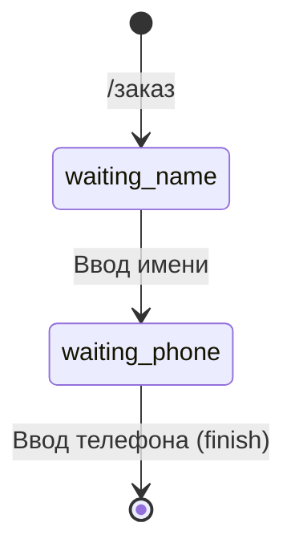

# FSM (конечные автоматы)

FSM позволяет создавать многошаговые диалоги с пользователем, сохраняя состояние между сообщениями.

## Определение состояний

Состояния определяются через `StateGroup` и `State`:

```python
from vkflow.app.fsm import StateGroup, State

class OrderStates(StateGroup):
    waiting_name = State()
    waiting_phone = State()
    confirm = State()
```

!!! note "StateGroup vs StrEnum"
    В отличие от обычных перечислений, `StateGroup` и `State` предоставляют дополнительную функциональность: автоматическое присвоение имён состояний и удобную интеграцию с хранилищами.

## Настройка хранилища

```python
import vkflow as vf
from vkflow.app.fsm import MemoryStorage

app = vf.App(prefixes=["!"])
app.set_fsm_storage(MemoryStorage())
```

`MemoryStorage` хранит данные в оперативной памяти. При перезапуске бота данные теряются.

### SQLiteStorage

Для сохранения состояний между перезапусками используйте `SQLiteStorage`:

```python
from vkflow.app.fsm import SQLiteStorage

app = vf.App(prefixes=["!"])
app.set_fsm_storage(SQLiteStorage("bot_states.db"))
```

!!! note "Зависимость"
    Для асинхронной работы рекомендуется пакет `aiosqlite`: `pip install aiosqlite`.
    Без него SQLiteStorage будет использовать стандартный `sqlite3` через `asyncio.to_thread`.

#### Параметры

| Параметр | Тип | По умолчанию | Описание |
|----------|-----|--------------|----------|
| `path` | `str` | `"fsm.db"` | Путь к файлу БД или `":memory:"` |
| `ttl` | `float \| None` | `None` | TTL в секундах, `None` — без ограничений |

#### TTL и очистка

```python
storage = SQLiteStorage("fsm.db", ttl=3600)

# Просроченные записи удаляются автоматически при чтении.
# Для массовой очистки:
removed = await storage.cleanup()
print(f"Удалено {removed} просроченных записей")
```

#### Отладка

```python
count = await storage.get_states_count()  # Количество активных состояний
keys = await storage.get_keys()           # Список ключей с активными состояниями
```

#### Context manager

```python
async with SQLiteStorage("fsm.db") as storage:
    router = FSMRouter(storage)
    # ...
# Соединение закрывается автоматически
```

### RedisStorage

Для продакшн-окружений с высокой нагрузкой используйте `RedisStorage`:

```python
from vkflow.app.fsm import RedisStorage

app = vf.App(prefixes=["!"])
app.set_fsm_storage(RedisStorage("redis://localhost:6379/0"))
```

!!! note "Зависимость"
    Требуется пакет `redis`: `pip install redis` или `pip install vkflow[redis]`

#### Параметры

| Параметр | Тип | По умолчанию | Описание |
|----------|-----|--------------|----------|
| `url` | `str` | `"redis://localhost:6379/0"` | URL подключения к Redis |
| `ttl` | `int \| None` | `None` | TTL в секундах (нативный Redis EXPIRE) |
| `prefix` | `str` | `"vkflow:fsm:"` | Префикс ключей для изоляции данных |
| `client` | `Redis \| None` | `None` | Существующий клиент `redis.asyncio.Redis` |

#### TTL

В отличие от SQLiteStorage, RedisStorage использует нативный механизм TTL через `EXPIRE`. Просроченные ключи удаляются самим Redis — без дополнительных проверок и фоновых задач:

```python
storage = RedisStorage("redis://localhost:6379/0", ttl=3600)
```

#### Префикс ключей

Префикс позволяет запускать несколько ботов на одном Redis без конфликтов:

```python
storage_bot1 = RedisStorage(prefix="bot1:fsm:")
storage_bot2 = RedisStorage(prefix="bot2:fsm:")
```

#### Свой клиент Redis

Если у вас уже есть подключение к Redis, передайте его через `client`. В этом случае `url` игнорируется, а при `close()` соединение **не закрывается** — управление остаётся за вами:

```python
import redis.asyncio as aioredis

client = aioredis.Redis(host="redis.example.com", port=6379, db=2)
storage = RedisStorage(client=client)
```

#### Отладка

```python
count = await storage.get_states_count()  # Количество активных состояний
keys = await storage.get_keys()           # Список ключей (без префикса)
```

#### Context manager

```python
async with RedisStorage("redis://localhost:6379/0", ttl=3600) as storage:
    router = FSMRouter(storage)
    # ...
# Соединение закрывается автоматически
```

### Сравнение хранилищ

| | MemoryStorage | SQLiteStorage | RedisStorage |
|---|---|---|---|
| Персистентность | Нет | Да | Да |
| TTL | Встроенный | Встроенный | Нативный (Redis EXPIRE) |
| Зависимости | Нет | `aiosqlite` (опционально) | `redis` |
| Мульти-процесс | Нет | Нет | Да |
| Лучше всего для | Разработка, тесты | Небольшие боты | Продакшн, высокая нагрузка |

## Визуализация переходов



## Базовый пример

```python
from vkflow.app.fsm import StateGroup, State, MemoryStorage

class OrderStates(StateGroup):
    waiting_name = State()
    waiting_phone = State()

app = vf.App(prefixes=["!"])
app.set_fsm_storage(MemoryStorage())

# Команда запускает FSM
@app.command("заказ")
async def start_order(ctx: vf.Context):
    fsm = app.get_fsm(ctx)
    await fsm.set_state(OrderStates.waiting_name)
    await ctx.reply("Введите ваше имя:")

# Обработчик состояния waiting_name
@app.state(OrderStates.waiting_name)
async def process_name(ctx, msg):
    # ctx -FSMContext, msg -NewMessage
    await ctx.update_data(name=msg.msg.text)
    await ctx.set_state(OrderStates.waiting_phone)
    await msg.reply("Введите телефон:")

# Обработчик состояния waiting_phone
@app.state(OrderStates.waiting_phone)
async def process_phone(ctx, msg):
    data = await ctx.finish()  # Получить данные и очистить состояние
    await msg.reply(f"Заказ принят!\nИмя: {data['name']}\nТелефон: {msg.msg.text}")
```

## FSMContext API

`FSMContext` (он же `ctx` в обработчиках состояний) предоставляет:

```python
# Управление состоянием
await ctx.get_state()          # Получить текущее состояние (str | None)
await ctx.set_state(state)     # Установить состояние (State, str или None)
await ctx.set_state(None)      # Очистить состояние

# Управление данными
await ctx.get_data()           # Получить все данные (dict)
await ctx.update_data(key=val) # Обновить/добавить данные (возвращает полный dict)
await ctx.set_data({"key": 1}) # Заменить все данные

# Очистка
await ctx.clear()              # Очистить состояние и данные
await ctx.finish()             # Получить данные и очистить (удобно для последнего шага)

# Свойства
ctx.api       # Экземпляр API
ctx.message   # Оригинальное сообщение (NewMessage | CallbackButtonPressed)
ctx.key       # Ключ хранилища (str)
ctx.strategy  # Стратегия генерации ключа
```

## Получение FSMContext

### Из команды (через App)

```python
@app.command("старт")
async def start(ctx: vf.Context):
    fsm = app.get_fsm(ctx)
    await fsm.set_state(MyStates.step1)
```

### Из обработчика состояния

В обработчиках `@app.state()` и `@router.state()` контекст инжектируется автоматически:

```python
@app.state(MyStates.step1)
async def handle(ctx, msg):
    # ctx -это FSMContext
    await ctx.update_data(...)
```

## Инъекция параметров

В обработчиках состояний аргументы инжектируются по имени:

| Имя параметра | Что подставляется |
|---------------|-------------------|
| `ctx`, `fsm` | `FSMContext` |
| `msg`, `message` | `NewMessage` или `CallbackButtonPressed` |
| `data` | Текущие данные FSM (`dict`) |
| `state` | Текущее состояние (`str`) |

```python
@app.state(OrderStates.waiting_name)
async def handle(ctx, msg, data, state):
    # ctx -FSMContext
    # msg -NewMessage
    # data -результат ctx.get_data()
    # state -результат ctx.get_state()
    print(f"State: {state}, Data: {data}")
```

## Стратегии ключей

Стратегия определяет, как генерируется ключ для хранилища:

```python
from vkflow.app.fsm import KeyStrategy

# USER_CHAT (по умолчанию) -раздельное состояние для каждого пользователя в каждом чате
app.set_fsm_storage(MemoryStorage())
fsm = app.get_fsm(ctx, strategy="user_chat")  # fsm:user_id:peer_id

# USER -одно состояние пользователя во всех чатах
fsm = app.get_fsm(ctx, strategy="user")       # fsm:user_id

# CHAT -одно состояние для всего чата
fsm = app.get_fsm(ctx, strategy="chat")       # fsm:peer_id
```

## FSM Router

Для сложных сценариев используйте отдельный роутер:

```python
from vkflow.app.fsm import Router as FSMRouter, MemoryStorage, StateGroup, State

class OrderStates(StateGroup):
    waiting_name = State()
    waiting_phone = State()

storage = MemoryStorage()
router = FSMRouter(storage)

@router.state(OrderStates.waiting_name)
async def handle_name(ctx, msg):
    await ctx.update_data(name=msg.msg.text)
    await ctx.set_state(OrderStates.waiting_phone)
    await msg.reply("Введите телефон:")

@router.state(OrderStates.waiting_phone)
async def handle_phone(ctx, msg):
    data = await ctx.finish()
    await msg.reply(f"Заказ: {data['name']}, тел: {msg.msg.text}")

# Хуки роутера
@router.before_state()
async def log_before(ctx, msg):
    print(f"FSM processing for {msg.msg.from_id}")

@router.after_state()
async def log_after(ctx, msg):
    print(f"FSM done for {msg.msg.from_id}")

# Подключение к приложению
app.include_fsm_router(router)
```

### Вложенные роутеры

```python
main_router = FSMRouter(storage)
sub_router = FSMRouter(storage)

@sub_router.state(SomeState.step1)
async def handle(ctx, msg):
    ...

main_router.include_router(sub_router)
app.include_fsm_router(main_router)
```

## FSM в Cog

```python
from vkflow import commands
from vkflow.app.fsm import MemoryStorage, StateGroup, State, state as fsm_state

class OrderStates(StateGroup):
    waiting_name = State()
    waiting_phone = State()

class OrderCog(commands.Cog):
    def __init__(self):
        self.fsm_storage = MemoryStorage()  # Обязательно!

    @commands.command(name="заказ")
    async def start_order(self, ctx: commands.Context):
        fsm = self.get_fsm(ctx)
        await fsm.set_state(OrderStates.waiting_name)
        await ctx.reply("Введите имя:")

    @fsm_state(OrderStates.waiting_name)
    async def handle_name(self, ctx, msg):
        await ctx.update_data(name=msg.msg.text)
        await ctx.set_state(OrderStates.waiting_phone)
        await msg.reply("Введите телефон:")

    @fsm_state(OrderStates.waiting_phone)
    async def handle_phone(self, ctx, msg):
        data = await ctx.finish()
        await msg.reply(f"Заказ: {data['name']}, {msg.msg.text}")

# Подключение
await app.add_cog(OrderCog())
```

## FSM в View

```python
from vkflow.ui.view import View, button
from vkflow.app.fsm import MemoryStorage

class OrderView(View):
    fsm_storage = MemoryStorage()  # Атрибут класса!

    @button(label="Подтвердить", color="positive")
    async def confirm(self, ctx, fsm):
        # fsm автоматически инжектируется
        data = await fsm.finish()
        await ctx.show_snackbar(f"Заказ подтверждён!")
        self.stop()

    @button(label="Отмена", color="negative")
    async def cancel(self, ctx, fsm):
        await fsm.clear()
        await ctx.show_snackbar("Отменено")
        self.stop()
```

## Фильтры по состоянию

```python
from vkflow.app.fsm import StateFilter, NotStateFilter

# Команда доступна только если пользователь в определённом состоянии
@commands.command(filter=StateFilter(storage, OrderStates.confirm))
async def confirm(ctx):
    ...

# Команда доступна только если пользователь НЕ в состоянии
@commands.command(filter=NotStateFilter(storage, OrderStates.waiting_name))
async def other(ctx):
    ...
```

## Кастомное хранилище

Для создания своего хранилища наследуйтесь от `BaseStorage` и реализуйте обязательные методы:

```python
from vkflow.app.fsm.storage import BaseStorage

class MyStorage(BaseStorage):
    async def get_state(self, key: str) -> str | None: ...
    async def set_state(self, key: str, state: str) -> None: ...
    async def delete_state(self, key: str) -> None: ...
    async def get_data(self, key: str) -> dict: ...
    async def set_data(self, key: str, data: dict) -> None: ...
    async def update_data(self, key: str, **kwargs) -> dict: ...
    async def delete_data(self, key: str) -> None: ...
    async def close(self) -> None: ...        # опционально
    async def clear(self, key: str) -> None: ... # опционально (по умолчанию вызывает delete_state + delete_data)
```

## Пример: Анкета

```python
from vkflow.app.fsm import StateGroup, State, MemoryStorage

class SurveyStates(StateGroup):
    name = State()
    age = State()
    city = State()

app.set_fsm_storage(MemoryStorage())

@app.command("анкета")
async def start_survey(ctx: vf.Context):
    fsm = app.get_fsm(ctx)
    await fsm.set_state(SurveyStates.name)
    await ctx.reply("Как вас зовут?")

@app.state(SurveyStates.name)
async def survey_name(ctx, msg):
    await ctx.update_data(name=msg.msg.text)
    await ctx.set_state(SurveyStates.age)
    await msg.reply("Сколько вам лет?")

@app.state(SurveyStates.age)
async def survey_age(ctx, msg):
    try:
        age = int(msg.msg.text)
    except ValueError:
        await msg.reply("Введите число!")
        return

    await ctx.update_data(age=age)
    await ctx.set_state(SurveyStates.city)
    await msg.reply("Из какого вы города?")

@app.state(SurveyStates.city)
async def survey_city(ctx, msg):
    data = await ctx.finish()
    await msg.reply(
        f"Анкета заполнена!\n"
        f"Имя: {data['name']}\n"
        f"Возраст: {data['age']}\n"
        f"Город: {msg.msg.text}"
    )
```
